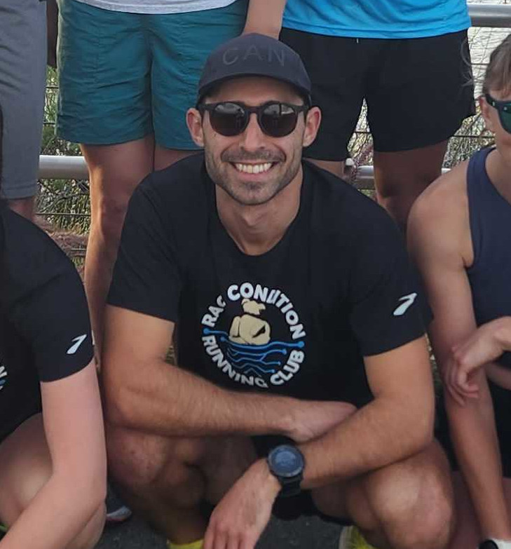

Zac is the head coach at {{site.title}}. With over 15 years of experience in
endurance running, he has raced everything from 800m up to the marathon. He has
also coached atheletes to race distances from the 5k to the marathon.

Some of his recent performance highlights:

- 16:42 5k at the 2022 Triton 5k
- 2:49 marathon at the 2022 Philadelphia Marathon
- 1:16 half marathon at the 2022 Pacific Beach Half Marathon

In addition, he has started and coaches [a running club at UC San Diego](https://ucsd-race-condition.github.io/) where he
volunteers and provides his training and guidance to runners from a wide variety
of backgrounds. Runners range in experience from previous NCAA Division I
athletes to those running their first 5k.

Zac has a USA Track & Field Level 1 certification and regularly reads the latest
academic articles on the topics of endurance running. He also enjoys cycling for
his cross training and regularly rides on the weekends.

